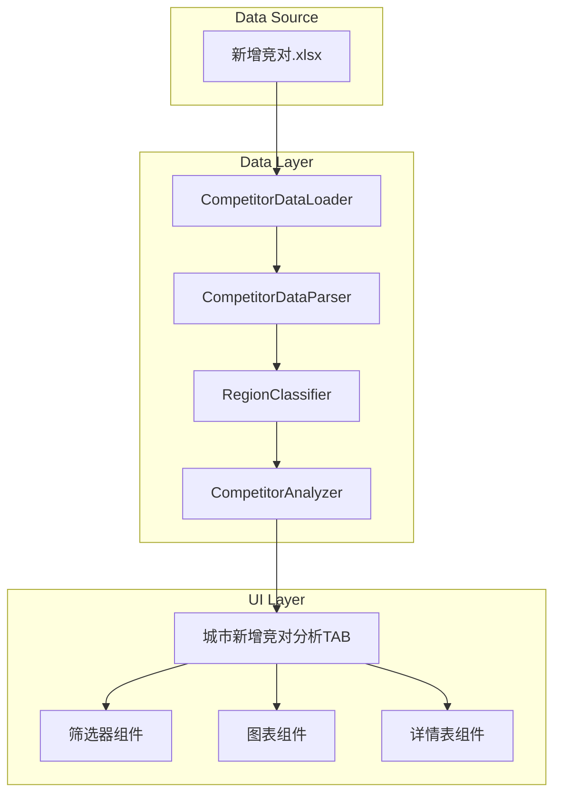

# Design Document: 城市新增竞对分析

## Overview

本功能为O2O门店数据分析看板新增一个"城市新增竞对分析"TAB页面，用于分析各城市5km范围内的新增竞对情况。系统将读取Excel格式的竞对数据，进行数据解析、区域识别、统计分析，并以可视化图表和数据表格的形式展示分析结果。

核心功能包括：
1. 动态解析多列竞对数据（宽表转长表）
2. 智能识别门店区域类型（市区/县城）
3. 多维度统计分析（城市、品牌、商圈）
4. 交互式数据筛选和排序
5. 品牌特性关键词洞察

## Architecture



## Components and Interfaces

### 1. CompetitorDataLoader (数据加载器)

负责从Excel文件加载原始数据。

```python
class CompetitorDataLoader:
    def __init__(self, file_path: str):
        """初始化数据加载器"""
        pass
    
    def load_data(self) -> pd.DataFrame:
        """加载Excel数据，返回原始DataFrame"""
        pass
    
    def validate_columns(self, df: pd.DataFrame) -> tuple[bool, list[str]]:
        """验证必需列是否存在，返回(是否有效, 缺失列列表)"""
        pass
```

### 2. CompetitorDataParser (数据解析器)

负责将宽表格式转换为长表格式，动态识别多个竞对列。

```python
class CompetitorDataParser:
    REQUIRED_COLUMNS = ['门店名称', '城市', '运营', '商圈类型', 
                        '5km内竞对数量', '近15天5km内新增竞对数量']
    COMPETITOR_PATTERN = r'^新增竞对\d+$'
    ATTRIBUTE_COLUMNS = ['品牌特性', 'sku数', '商补率']
    
    def parse_wide_to_long(self, df: pd.DataFrame) -> pd.DataFrame:
        """将宽表转换为长表格式
        
        输入: 门店名称 | 城市 | ... | 新增竞对1 | 品牌特性 | sku数 | 商补率 | 新增竞对2 | ...
        输出: 门店名称 | 城市 | ... | 竞对名称 | 品牌特性 | sku数 | 商补率 | 竞对序号
        """
        pass
    
    def detect_competitor_columns(self, df: pd.DataFrame) -> list[dict]:
        """动态检测竞对列及其属性列
        
        返回: [{'competitor_col': '新增竞对1', 'brand_col': '品牌特性', 
                'sku_col': 'sku数', 'subsidy_col': '商补率'}, ...]
        """
        pass
```

### 3. RegionClassifier (区域分类器)

负责根据门店名称识别区域类型（市区/县城）。

```python
class RegionClassifier:
    # 县级行政区划名单
    COUNTY_LIST = ['句容', '丹阳', '扬中', '沛县', '丰县', ...]
    
    # 市区区名列表
    DISTRICT_LIST = ['江宁', '建邺', '鼓楼', '玄武', ...]
    
    # 关键词规则
    COUNTY_KEYWORDS = ['县', '镇', '乡']
    CITY_KEYWORDS = ['区', '路', '街', '广场', '大道', '万达', '吾悦']
    
    def classify(self, store_name: str, city: str) -> str:
        """识别门店区域类型
        
        Args:
            store_name: 门店名称
            city: 城市名称
            
        Returns:
            '市区' | '县城' | '未知'
        """
        pass
    
    def classify_batch(self, df: pd.DataFrame) -> pd.DataFrame:
        """批量识别区域类型，添加'区域类型'列"""
        pass
```

### 4. CompetitorAnalyzer (竞对分析器)

负责执行各种统计分析。

```python
class CompetitorAnalyzer:
    def __init__(self, df: pd.DataFrame):
        """初始化分析器，df为长表格式数据"""
        pass
    
    def get_city_summary(self) -> pd.DataFrame:
        """获取城市维度汇总
        
        返回: 城市 | 门店数 | 5km内竞对总数 | 新增竞对数 | 占比
        """
        pass
    
    def get_brand_ranking(self, top_n: int = 10) -> pd.DataFrame:
        """获取品牌排行
        
        返回: 品牌名称 | 出现次数 | 占比
        """
        pass
    
    def get_business_circle_analysis(self) -> pd.DataFrame:
        """获取商圈类型分析
        
        返回: 商圈类型 | 门店数 | 平均竞对数 | 平均新增竞对数
        """
        pass
    
    def get_region_analysis(self) -> pd.DataFrame:
        """获取区域类型分析
        
        返回: 区域类型 | 门店数 | 竞对总数 | 新增竞对数
        """
        pass
    
    def get_competitor_details(self, filters: dict = None) -> pd.DataFrame:
        """获取竞对详情表（支持筛选）
        
        Args:
            filters: {'city': '南京市', 'business_circle': '强', 'brand': '满佳喜'}
            
        返回: 门店名称 | 城市 | 商圈类型 | 区域类型 | 竞对名称 | 品牌特性 | SKU数 | 商补率
        """
        pass
    
    def extract_brand_keywords(self) -> dict[str, int]:
        """提取品牌特性关键词及频次
        
        返回: {'低起送': 5, '神券': 3, '新客立减': 8, ...}
        """
        pass
```

### 5. UI Components (UI组件)

```python
def create_city_competitor_tab():
    """创建城市新增竞对分析TAB页面"""
    pass

def create_filter_panel():
    """创建筛选器面板（城市、商圈类型、区域类型、品牌）"""
    pass

def create_city_summary_chart(data: pd.DataFrame):
    """创建城市汇总图表（柱状图+饼图）"""
    pass

def create_brand_ranking_chart(data: pd.DataFrame):
    """创建品牌排行图表"""
    pass

def create_business_circle_chart(data: pd.DataFrame):
    """创建商圈分析图表"""
    pass

def create_region_comparison_chart(data: pd.DataFrame):
    """创建市区/县城对比图表"""
    pass

def create_keyword_cloud(keywords: dict):
    """创建品牌特性关键词云"""
    pass

def create_competitor_detail_table(data: pd.DataFrame):
    """创建竞对详情表"""
    pass
```

## Data Models

### 原始数据结构（宽表）

| 字段 | 类型 | 说明 |
|------|------|------|
| 门店名称 | string | 门店全称 |
| 城市 | string | 所在城市 |
| 运营 | string | 运营人员 |
| 商圈类型 | string | 强/中/弱 |
| 5km内竞对数量 | int | 竞对总数 |
| 近15天5km内新增竞对数量 | int | 新增竞对数 |
| 新增竞对N | string | 第N个新增竞对名称 |
| 品牌特性 | string | 对应竞对的品牌特性 |
| sku数 | float | 对应竞对的SKU数量 |
| 商补率 | string | 对应竞对的商补率区间 |

### 转换后数据结构（长表）

| 字段 | 类型 | 说明 |
|------|------|------|
| 门店名称 | string | 门店全称 |
| 城市 | string | 所在城市 |
| 运营 | string | 运营人员 |
| 商圈类型 | string | 强/中/弱 |
| 区域类型 | string | 市区/县城/未知 |
| 5km内竞对数量 | int | 竞对总数 |
| 近15天5km内新增竞对数量 | int | 新增竞对数 |
| 竞对名称 | string | 新增竞对名称 |
| 品牌特性 | string | 品牌特性描述 |
| SKU数 | float | SKU数量 |
| 商补率 | string | 商补率区间 |
| 竞对序号 | int | 第几个新增竞对 |

## Correctness Properties

*A property is a characteristic or behavior that should hold true across all valid executions of a system-essentially, a formal statement about what the system should do. Properties serve as the bridge between human-readable specifications and machine-verifiable correctness guarantees.*

### Property 1: 数据解析完整性
*For any* 包含N个新增竞对列的Excel文件，解析后的长表应包含所有非空竞对记录，且每条记录的属性字段（品牌特性、SKU数、商补率）与原始宽表对应列的值一致。
**Validates: Requirements 1.1, 1.2, 1.4**

### Property 2: 城市统计正确性
*For any* 竞对数据集，各城市新增竞对数量之和应等于总新增竞对数量，且各城市占比之和应等于100%（允许浮点误差±0.01）。
**Validates: Requirements 2.1, 2.2, 2.3**

### Property 3: 品牌排行正确性
*For any* 竞对数据集，品牌排行中的TOP N品牌应按出现次数严格降序排列，且每个品牌的出现次数应等于该品牌在数据集中的实际出现次数。
**Validates: Requirements 3.1, 3.2**

### Property 4: 商圈分组统计正确性
*For any* 竞对数据集，按商圈类型分组后，每组的平均竞对数量应等于该组所有门店竞对数量之和除以门店数量。
**Validates: Requirements 4.1, 4.2**

### Property 5: 详情表筛选正确性
*For any* 筛选条件组合，筛选后的详情表中每条记录都应满足所有筛选条件，且不应遗漏任何满足条件的记录。
**Validates: Requirements 5.2, 5.3, 6.5**

### Property 6: 区域类型识别一致性
*For any* 门店名称，如果名称包含县级行政区划名单中的地名，则应识别为"县城"；如果包含市区区名列表中的地名，则应识别为"市区"；关键词规则仅在名单匹配失败时生效。
**Validates: Requirements 6.1, 6.2, 6.3**

### Property 7: 关键词提取完整性
*For any* 品牌特性文本集合，提取的关键词频次之和应大于等于非空品牌特性记录数（因为一条记录可能包含多个关键词）。
**Validates: Requirements 7.1, 7.2**

## Error Handling

| 错误场景 | 处理方式 |
|---------|---------|
| Excel文件不存在 | 显示错误提示，引导用户上传文件 |
| 必需列缺失 | 显示缺失列名称，提示用户检查文件格式 |
| 数据为空 | 显示"暂无数据"提示 |
| 数值列包含非数值 | 使用pd.to_numeric(errors='coerce')转换，无效值置为NaN |
| 区域类型无法识别 | 标记为"未知"，不影响其他分析 |

## Testing Strategy

### 测试框架选择

- 单元测试：pytest
- 属性测试：hypothesis

### 单元测试

1. **数据加载测试**
   - 测试正常Excel文件加载
   - 测试文件不存在的错误处理
   - 测试列缺失的错误处理

2. **数据解析测试**
   - 测试单个竞对列的解析
   - 测试多个竞对列的解析
   - 测试空值处理

3. **区域分类测试**
   - 测试县级名单匹配
   - 测试市区名单匹配
   - 测试关键词规则匹配
   - 测试未知情况处理

4. **统计分析测试**
   - 测试城市汇总计算
   - 测试品牌排行计算
   - 测试商圈分组计算

### 属性测试

每个属性测试必须：
- 使用hypothesis库生成随机测试数据
- 运行至少100次迭代
- 使用注释标注对应的正确性属性

```python
# **Feature: city-competitor-analysis, Property 1: 数据解析完整性**
@given(competitor_data=competitor_data_strategy())
@settings(max_examples=100)
def test_data_parsing_completeness(competitor_data):
    """验证宽表转长表的数据完整性"""
    pass

# **Feature: city-competitor-analysis, Property 2: 城市统计正确性**
@given(competitor_records=competitor_records_strategy())
@settings(max_examples=100)
def test_city_statistics_correctness(competitor_records):
    """验证城市统计的正确性"""
    pass
```
